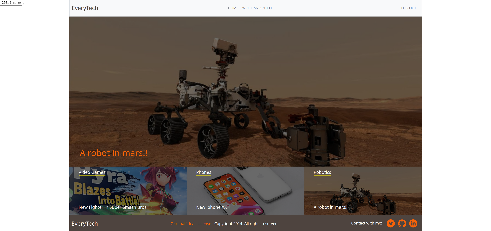

# Every-tech

## App screenshot

<center>
  
</center>

## Presentation Project Video


## About

Every-Tech is a capstone project for the Microverse course, in this project, I use the use of the MVP architectural pattern, this is a project where an user can create an account and use it to post articles or vote for articles of other users, the user can also unvote an article whenever he wants, the project makes use of Active Storage for storage the articles images.

## Live Link

[Every-Tech](https://secure-brushlands-86938.herokuapp.com/)

## Built With

- Ruby v3.0.0
- Ruby on Rails v6.1.1
- PostgreSQL
- Bootstrap
- Rails Active Storage
- Rspec
- Capybara
- Rubocop
- VS Code
- Heroku

## Getting Started

To get a local copy up and running follow these simple example steps:
- Fork this project
- Open your terminal
- Clone this project `git clone git@github.com:helman101/Every-Tech.git`
- Go to the project folder `cd Every-tech`

### Prerequisites

- Ruby: 3.0.0
- Rails: 6.1.1
- Postgres
- Sqlite3

### Setup

Instal gems with:

```
  bundle install
```

Instal yarn and webpacker with:

```
  yarn install
  rails webpacker:install
```

Setup database with:

```
   rails db:create
   rails db:migrate
```

### Drive local host

Start server with:

```
    rails server
```

Open `http://localhost:3000/` in your browser.

### Run tests

- Open terminal
- install ChromeDriver `sudo apt-get install chromium-chromedriver`
- Run tests `rspec`


## Authors

👤 **Andres Ortegon**

- Github: [@Helman101](https://github.com/helman101)
- Twitter: [@Helman1011](https://twitter.com/Helman1011)
- Linkedin: [Linkedin](https://www.linkedin.com/in/helman101/)

## 🤝 Contributing

Contributions, issues and feature requests are welcome!

Feel free to check the [issues page](issues/).

## Show your support

Give a ⭐️ if you like this project!

## Acknowledgments

- Microverse
- [Nelson Sakwa](https://www.behance.net/sakwadesignstudio)

## 📝 License

[Licence](LICENSE)